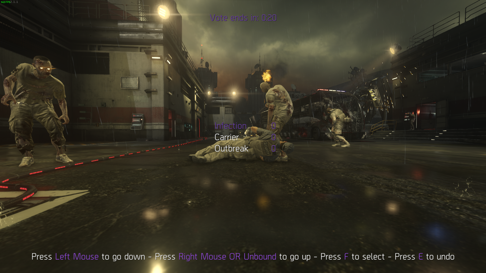

# Mapvote

A customizable mapvote script for both multiplayer and survival.  
It also works on zombies but it crashes after some time.  
**[IMPORTANT]** If you want to use this mapvote in zombies then read the [notes section](#notes).

This works for both custom games and dedicated servers.  


*Multiplayer mode. Mouse and keyboard input. Changed settings: horizontal spacing: 100*


*Survival mode. Controller input. Changed settings: red colors, accent mode: max*


*Zombies mode. Mouse and keyboard input. Changed settings: purple colors, horizontal spacing: 50*

## mapvote.gsc

**[IMPORTANT]** Installing `_gamelogic.gsc` in `s1x\maps\mp\gametypes` (in the game folder) is **mandatory** to make the mapvote work normally.  

### Main features

- It allows up to 11 elements (maps + modes) to be displayed on screen
- You can configure how much maps and modes you want on screen
- It will automatically adapt the amount of elements to display if you don't choose a fixed amount of maps/modes to show
- It has separate map and mode choices for multiplayer
- It supports custom gamemode names in multiplayer
- It rotates a random map from the list when there are no votes for maps. Same applies for modes in multiplayer too
- You can choose to rotate a random map and mode from a list you define when the human players count is between a min and max values you define (disabled by default)
- Controllers are fully supported and work out of the box
- It has a good level of customization
- It has a debug mode to quickly preview the menu and print some values in the console

### Getting started

By default the script is disabled to avoid running on all your servers.  
Simply set `mapvote_enable` to 1 and the script will be loaded, which as a result will display the voting menu when the game ends (after the killcam in multiplayer and once every players are dead in survival or zombies).  

To configure the menu before putting it on your server I recommend running it in a custom game with the `mapvote_debug` dvar set to `1`.  
To do that use this command in the console `set mapvote_enable 1;set mapvote_debug 1` before running a custom game.  
Start a custom game and you will see the menu.  
You can then configure the dvars directly in your console and restart the map with `map_restart` in the console to edit the menu quickly and get your perfect setup.

### Dvars

Here are the dvars you can configure:

<details>
  <summary>Multiplayer dvars</summary>
  
  | Name | Description | Default value | Accepted values |
|---|---|---|---|
| mapvote_enable | Toggle whether the mapvote is activated or not. 0 is off and 1 is on | 0 | 0 or 1 |
| mapvote_debug | Toggle whether the mapvote runs in debug mode or not. This will display the mapvote menu a few seconds after starting the game. 0 is off and 1 is on | 0 | 0 or 1 |
| mapvote_maps | A list of the maps that are available for rotation | Every maps including DLC maps | Any map name. Each map is separated with a colon (:) |
| mapvote_modes | A list of the modes that are available for rotation. The first parameter is how the mode will be displayed, it can be set to anything you like, the second parameter is the name of the cfg file to load | "Team Deathmatch,war:Domination,dom" | Any text followed by a comma (,) and then the cfg name. Each block is separated with a colon (:) |
| mapvote_limits_maps | The amount of maps to display. 0 will handle it automatically | 0 | Any plain number from 0 to `mapvote_limits_max` |
| mapvote_limits_modes | The amount of modes to display. 0 will handle it automatically | 0 | Any plain number from 0 to `mapvote_limits_max` |
| mapvote_limits_max | The maximum amount of elements to display (maps + modes) | 11 | Any plain number |
| mapvote_colors_selected | The color of the text when hovered or selected. This is also the color of the votes count | blue | red, green, yellow, blue, cyan, purple, white, grey, gray, black |
| mapvote_colors_unselected | The color of the text when not hovered and not selected | white | red, green, yellow, blue, cyan, purple, white, grey, gray, black |
| mapvote_colors_timer | The color of the timer as long as it has more than 5 seconds remaining | blue | red, green, yellow, blue, cyan, purple, white, grey, gray, black |
| mapvote_colors_timer_low | The color of the timer when it has 5 or less seconds remaining | red | red, green, yellow, blue, cyan, purple, white, grey, gray, black |
| mapvote_colors_help_text | The color of the help text at the bottom explaining how to use the menu | white | red, green, yellow, blue, cyan, purple, white, grey, gray, black |
| mapvote_colors_help_accent | The color of the accented text of the help text at the bottom | blue | red, green, yellow, blue, cyan, purple, white, grey, gray, black |
| mapvote_colors_help_accent_mode | The accenting mode for the help text. `standard` only puts the accent color on the button to press and `max` puts it on both the buttons and the action it does | standard | standard or max |
| mapvote_sounds_menu_enabled | Toggle whether the mapvote menu sounds are enabled or not. 0 is off and 1 is on | 1 | 0 or 1 |
| mapvote_sounds_timer_enabled | Toggle whether the timer will start making a beeping sound every second when there's 5 or less seconds remaining to vote or not. 0 is off and 1 is on | 1 | 0 or 1 |
| mapvote_vote_time | The time the vote lasts (in seconds) | 30 | Any plain number above 5 |
| mapvote_horizontal_spacing | The horizontal spacing between the map/mode names on the left and the vote counts on the right. I recommend setting this value according to the longest map or mode name length so that it doesn't overlap with the vote counts | 75 | Any plain number |
| mapvote_default_rotation_maps | A list of the maps that are available for default rotation | "Detroit:Greenband:Terrace" | Any map name. Each map is separated with a colon (:) |
| mapvote_default_rotation_modes  | A list of the modes that are available for default rotation. It needs to be a valid gametype | "tdm" | Any gametype. Each gametype is separated with a colon (:) |
| mapvote_default_rotation_min_players | The minimum amount of human players required to rotate the default rotation instead of showing the mapvote. If the human players count is smaller than this then it will display the mapvote | 0 | Any plain number from 0 to 18 |
| mapvote_default_rotation_max_players | The maximum amount of human players required to rotate the default rotation instead of showing the mapvote. If the human players count is higher than this then it will display the mapvote | 0 | Any plain number from 0 to 18 |
  
</details>

<details>
  <summary>Survival dvars</summary>
  
  | Name | Description | Default value | Accepted values |
|---|---|---|---|
| mapvote_enable | Toggle whether the mapvote is activated or not. 0 is off and 1 is on | 0 | 0 or 1 |
| mapvote_debug | Toggle whether the mapvote runs in debug mode or not. This will display the mapvote menu a few seconds after starting the game. 0 is off and 1 is on | 0 | 0 or 1 |
| mapvote_maps | A list of the maps that are available for rotation | Every maps including DLC maps | Any map name. Each map is separated with a colon (:) |
| mapvote_limits_max | The maximum amount of maps to display | 10 | Any plain number |
| mapvote_colors_selected | The color of the text when hovered or selected. This is also the color of the votes count | blue | red, green, yellow, blue, cyan, purple, white, grey, gray, black |
| mapvote_colors_unselected | The color of the text when not hovered and not selected | white | red, green, yellow, blue, cyan, purple, white, grey, gray, black |
| mapvote_colors_timer | The color of the timer as long as it has more than 5 seconds remaining | blue | red, green, yellow, blue, cyan, purple, white, grey, gray, black |
| mapvote_colors_timer_low | The color of the timer when it has 5 or less seconds remaining | red | red, green, yellow, blue, cyan, purple, white, grey, gray, black |
| mapvote_colors_help_text | The color of the help text at the bottom explaining how to use the menu | white | red, green, yellow, blue, cyan, purple, white, grey, gray, black |
| mapvote_colors_help_accent | The color of the accented text of the help text at the bottom | blue | red, green, yellow, blue, cyan, purple, white, grey, gray, black |
| mapvote_colors_help_accent_mode | The accenting mode for the help text. `standard` only puts the accent color on the button to press and `max` puts it on both the buttons and the action it does | standard | standard or max |
| mapvote_sounds_menu_enabled | Toggle whether the mapvote menu sounds are enabled or not. 0 is off and 1 is on | 1 | 0 or 1 |
| mapvote_sounds_timer_enabled | Toggle whether the timer will start making a beeping sound every second when there's 5 or less seconds remaining to vote or not. 0 is off and 1 is on | 1 | 0 or 1 |
| mapvote_vote_time | The time the vote lasts (in seconds) | 30 | Any plain number above 5 |
| mapvote_horizontal_spacing | The horizontal spacing between the map/mode names on the left and the vote counts on the right. I recommend setting this value according to the longest map or mode name length so that it doesn't overlap with the vote counts | 75 | Any plain number |
| mapvote_default_rotation_maps | A list of the maps that are available for default rotation | "Bio Lab:Retreat:Detroit:Ascend" | Any map name. Each map is separated with a colon (:) |
| mapvote_default_rotation_min_players | The minimum amount of human players required to rotate the default rotation instead of showing the mapvote. If the human players count is smaller than this then it will display the mapvote | 0 | Any plain number from 0 to 18 |
| mapvote_default_rotation_max_players | The maximum amount of human players required to rotate the default rotation instead of showing the mapvote. If the human players count is higher than this then it will display the mapvote | 0 | Any plain number from 0 to 18 |
  
</details>

<details>
  <summary>Zombies dvars</summary>
  
  | Name | Description | Default value | Accepted values |
|---|---|---|---|
| mapvote_enable | Toggle whether the mapvote is activated or not. 0 is off and 1 is on | 0 | 0 or 1 |
| mapvote_debug | Toggle whether the mapvote runs in debug mode or not. This will display the mapvote menu a few seconds after starting the game. 0 is off and 1 is on | 0 | 0 or 1 |
| mapvote_maps | A list of the maps that are available for rotation | Every maps including DLC maps | Any map name. Each map is separated with a colon (:) |
| mapvote_limits_max | The maximum amount of maps to display | 3 | Any plain number up to 4 |
| mapvote_colors_selected | The color of the text when hovered or selected. This is also the color of the votes count | blue | red, green, yellow, blue, cyan, purple, white, grey, gray, black |
| mapvote_colors_unselected | The color of the text when not hovered and not selected | white | red, green, yellow, blue, cyan, purple, white, grey, gray, black |
| mapvote_colors_timer | The color of the timer as long as it has more than 5 seconds remaining | blue | red, green, yellow, blue, cyan, purple, white, grey, gray, black |
| mapvote_colors_timer_low | The color of the timer when it has 5 or less seconds remaining | red | red, green, yellow, blue, cyan, purple, white, grey, gray, black |
| mapvote_colors_help_text | The color of the help text at the bottom explaining how to use the menu | white | red, green, yellow, blue, cyan, purple, white, grey, gray, black |
| mapvote_colors_help_accent | The color of the accented text of the help text at the bottom | blue | red, green, yellow, blue, cyan, purple, white, grey, gray, black |
| mapvote_colors_help_accent_mode | The accenting mode for the help text. `standard` only puts the accent color on the button to press and `max` puts it on both the buttons and the action it does | standard | standard or max |
| mapvote_sounds_menu_enabled | Toggle whether the mapvote menu sounds are enabled or not. 0 is off and 1 is on | 1 | 0 or 1 |
| mapvote_sounds_timer_enabled | Toggle whether the timer will start making a beeping sound every second when there's 5 or less seconds remaining to vote or not. 0 is off and 1 is on | 1 | 0 or 1 |
| mapvote_vote_time | The time the vote lasts (in seconds) | 30 | Any plain number above 5 |
| mapvote_horizontal_spacing | The horizontal spacing between the map/mode names on the left and the vote counts on the right. I recommend setting this value according to the longest map or mode name length so that it doesn't overlap with the vote counts | 75 | Any plain number |
| mapvote_default_rotation_maps | A list of the maps that are available for default rotation | "Outbreak" | Any map name. Each map is separated with a colon (:) |
| mapvote_default_rotation_min_players | The minimum amount of human players required to rotate the default rotation instead of showing the mapvote. If the human players count is smaller than this then it will display the mapvote | 0 | Any plain number from 0 to 18 |
| mapvote_default_rotation_max_players | The maximum amount of human players required to rotate the default rotation instead of showing the mapvote. If the human players count is higher than this then it will display the mapvote | 0 | Any plain number from 0 to 18 |
  
</details>

### Configuration

Below is an example CFG showing how each dvars can be configured.  
The values you see are the default values that will be used if you don't set a dvar.  

<details>
  <summary>Multiplayer CFG</summary>

  ```c
set mapvote_enable 1
set mapvote_maps "Ascend:Bio Lab:Comeback:Defender:Detroit:Greenband:Horizon:Instinct:Recovery:Retreat:Riot:Solar:Terrace:Atlas Gorge:Chop Shop:Climate:Compound:Core:Drift:Fracture:Kremlin:Overload:Parliament:Perplex:Quarantine:Sideshow:Site 244:Skyrise:Swarm:Urban"
set mapvote_modes "Team Deathmatch,war:Domination,dom"
set mapvote_limits_maps 0
set mapvote_limits_modes 0
set mapvote_limits_max 11
set mapvote_colors_selected "blue"
set mapvote_colors_unselected "white"
set mapvote_colors_timer "blue"
set mapvote_colors_timer_low "red"
set mapvote_colors_help_text "white"
set mapvote_colors_help_accent "blue"
set mapvote_colors_help_accent_mode "standard"
set mapvote_sounds_menu_enabled 1
set mapvote_sounds_timer_enabled 1
set mapvote_vote_time 30
set mapvote_horizontal_spacing 75
set mapvote_default_rotation_maps "Detroit:Greenband:Terrace"
set mapvote_default_rotation_modes "tdm"
set mapvote_default_rotation_min_players 0
set mapvote_default_rotation_max_players 0
```

Here are some pre-set values if you want to quickly copy/paste something

| Description | Value |
|---|---|
| All base game maps | "Ascend:Bio Lab:Comeback:Defender:Detroit:Greenband:Horizon:Instinct:Recovery:Retreat:Riot:Solar:Terrace" |
| All DLC maps | "Atlas Gorge:Chop Shop:Climate:Compound:Core:Drift:Fracture:Kremlin:Overload:Parliament:Perplex:Quarantine:Sideshow:Site 244:Skyrise:Swarm:Urban" |
| Classic modes | "Team Deathmatch,tdm:Domination,dom:Hardpoint,koth" |
| Alternative modes | "Kill Confirmed,conf:Capture the Flag,ctf" |
| FFA 24/7 | "Free for All,dm" |
| SND 24/7 | "Search & Destroy,sd" |
| Search & Rescue 24/7 | "Search & Rescue,sr" |
| Infected 24/7 | "Infected,infect" |

</details>

<details>
  <summary>Survival CFG</summary>

  ```c
set mapvote_enable 1
set mapvote_maps "Bio Lab:Retreat:Detroit:Ascend:Horizon:Comeback:Terrace:Instinct:Greenband:Solar:Recovery:Defender:Riot:Sideshow:Core:Drift:Urban"
set mapvote_limits_max 10
set mapvote_colors_selected "blue"
set mapvote_colors_unselected "white"
set mapvote_colors_timer "blue"
set mapvote_colors_timer_low "red"
set mapvote_colors_help_text "white"
set mapvote_colors_help_accent "blue"
set mapvote_colors_help_accent_mode "standard"
set mapvote_sounds_menu_enabled 1
set mapvote_sounds_timer_enabled 1
set mapvote_vote_time 30
set mapvote_horizontal_spacing 75
set mapvote_default_rotation_maps "Bio Lab:Retreat:Detroit:Ascend"
set mapvote_default_rotation_min_players 0
set mapvote_default_rotation_max_players 0
```

Here are some pre-set values if you want to quickly copy/paste something

| Description | Value |
|---|---|
| Tier 1 maps | "Bio Lab:Retreat:Detroit:Ascend" |
| Tier 2 maps | "Horizon:Comeback:Terrace:Instinct" |
| Tier 3 maps | "Greenband:Solar:Recovery:Defender" |
| Tier 4 maps | "Riot" |
| All DLC maps | "Sideshow:Core:Drift:Urban" |

</details>

</details>

<details>
  <summary>Zombies CFG</summary>

  ```c
set mapvote_enable 1
set mapvote_maps "Outbreak:Infection:Carrier:Descent"
set mapvote_limits_max 3
set mapvote_colors_selected "blue"
set mapvote_colors_unselected "white"
set mapvote_colors_timer "blue"
set mapvote_colors_timer_low "red"
set mapvote_colors_help_text "white"
set mapvote_colors_help_accent "blue"
set mapvote_colors_help_accent_mode "standard"
set mapvote_sounds_menu_enabled 1
set mapvote_sounds_timer_enabled 1
set mapvote_vote_time 30
set mapvote_horizontal_spacing 75
set mapvote_default_rotation_maps "Outbreak"
set mapvote_default_rotation_min_players 0
set mapvote_default_rotation_max_players 0
```

</details>

### Notes

- In zombies if you set `mapvote_limits_max` to 4 the game crashes after a few games because of an overflow error that I wasn't able to fix.  
The temporary fix I found is to set the limit to 3 which makes it crash after dozens of games.  
For this reason I only recommend using this mapvote script in zombies if you set the limit to 2 or 3 and play custom games or if your server isn't running 24/7 and you monitor it since it will eventually crash.
- Sadly I was unable to find how to set blur on the player screen so there's no blur
- If right click is set to toggle ads then pressing right click will make the player go up by one every 0.25s until he right clicks again.  
If I didn't change it to be that way players with toggle ads would have to press right click twice to go up by one all the time.  
Now instead they simply right click once to start going up and right click again to stop which is a better user experience.
- When there's only one map/mode, instead of showing a single vote possibility, your single map/mode will be hidden to make the user experience better but it will still always rotate to your one map/mode
- If some map/mode names or vote count don't display at all then you probably have other scripts that create HUD elements and there's too much elements to display so either remove your script or lower `mapvote_limits_max` so that the mapvote will have less elements to display. Note that some maps can display more elements than others so I recommend quickly trying all your maps if you change the values
- When two maps/modes have the same votes, the lowest one in the list will win. In the future it would be nice to randomize between both
- Ending the game with ESC doesn't work when in debug mode.  
Use `map_restart` in the console when your script is compiled. And if you want to leave use `disconnect` in the console until this is fixed  

## _gamelogic.gsc

A copy of `%localappdata%\xlabs\data\s1x\data\maps\mp\gametypes\_gamelogic.gsc` to make the mapvote work.  
It has to be installed in the `s1x\maps\mp\gametypes` directory found in your game folder so that it replaces the game's `_gamelogic.gsc`.  
The only thing that was changed is that the mapvote call logic has been added to `waittillfinalkillcamdone()`
